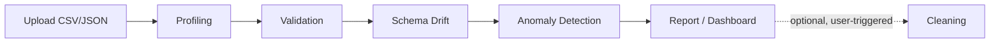

# Dataanalyticswithscoring
# DQ Monitor: AI-Driven Data Quality Monitoring

Upload a CSV or JSON file and get a full data quality report: profiling, rule-based validation, schema drift detection, and machine-learning anomaly detection, all in one dashboard.

> **Status:** 🚧 In development (v1). Sections marked *(planned)* are not built yet.

<!-- Add a dashboard screenshot or demo GIF here -->
<!--  -->

---

## The Problem

Data pipelines run automatically and continuously, but quality issues such as missing values, schema changes, duplicates, out-of-range values, and distribution shifts usually go unnoticed until they surface downstream in a broken dashboard, a wrong business decision, or a degraded ML model.

Most existing tools (Great Expectations, dbt tests) rely on **static, hand-written rules**. Someone has to anticipate every failure mode in advance, and those rules don't adapt as data evolves or catch subtle multivariate anomalies.

**DQ Monitor** combines rule-based checks with unsupervised ML (Isolation Forest) to flag problems a fixed rule would miss, and reports everything in one place.

---

## Features

- **Profiling:** per-column stats (null %, data types, min/max/mean/std, cardinality, top values)
- **Validation:** rule-based checks for types, ranges, formats, and duplicates
- **Schema drift detection:** compares each upload's structure against the previous one (added, removed, renamed, or retyped columns)
- **Anomaly detection:** Isolation Forest scores rows that don't fit the pattern of the rest of the data
- **Report and dashboard:** one consolidated view of everything found
- **Optional cleaning** *(planned)*: user-triggered fixes (fill or drop nulls, remove duplicates, fix type mismatches) with a downloadable cleaned file

### Design decision: detect first, clean second

Detection always runs on the **raw** upload. Cleaning is a separate, opt-in action after the report. This way the dashboard shows what actually came in, and problems aren't silently hidden before they've been reported.

---

## How It Works



| Stage | What it does |
|---|---|
| **Upload** | User submits a CSV or JSON file through the React UI |
| **Profiling** | Summarizes each column with pandas |
| **Validation** | Checks the data against defined rules |
| **Schema drift** | Compares column names and types with the previous upload |
| **Anomaly detection** | Isolation Forest flags rows that are outliers |
| **Report** | Combines all findings and stores them in PostgreSQL |
| **Cleaning** *(planned)* | Applies fixes only when the user asks |

---

## Tech Stack

| Layer | Technology |
|---|---|
| Backend | Python, FastAPI, Pydantic, Uvicorn |
| Data processing | pandas |
| ML | scikit-learn (Isolation Forest) |
| Database | PostgreSQL, SQLAlchemy |
| Frontend | React |
| Tooling | Docker Compose, Git |

---

## Project Structure

```
dq-monitor/
├── backend/
│   ├── app/
│   │   ├── main.py            # FastAPI entrypoint
│   │   ├── routers/
│   │   │   ├── upload.py      # POST /upload
│   │   │   └── results.py     # GET /results
│   │   ├── core/
│   │   │   ├── profiling.py   # column statistics
│   │   │   ├── validation.py  # rule-based checks
│   │   │   ├── drift.py       # schema comparison
│   │   │   └── anomaly.py     # Isolation Forest
│   │   ├── models/            # SQLAlchemy models
│   │   └── db.py
│   └── requirements.txt
├── frontend/                  # React app
├── docker-compose.yml
└── README.md
```

---

## Getting Started

### Prerequisites

- Python 3.11+
- Node.js 18+
- PostgreSQL 16 (or Docker)
- Git

### Option A: Docker Compose *(planned)*

```bash
git clone https://github.com/<your-username>/dq-monitor.git
cd dq-monitor
docker compose up
```

### Option B: Run manually

**Backend**

```bash
cd backend
python3 -m venv venv
source venv/bin/activate
pip install -r requirements.txt
cp .env.example .env        # then set your database credentials
uvicorn app.main:app --reload
```

The API runs at `http://localhost:8000`, with interactive docs at `http://localhost:8000/docs`.

**Frontend**

```bash
cd frontend
npm install
npm start
```

---

## API Overview *(planned)*

| Method | Endpoint | Description |
|---|---|---|
| `POST` | `/upload` | Upload a CSV/JSON file and run the full analysis |
| `GET` | `/results` | List all analyzed batches |
| `GET` | `/results/{batch_id}` | Full report for one batch |

---

## Evaluation *(planned)*

To measure detection quality, a fault injector corrupts clean data in controlled ways (nulls, duplicates, type flips, out-of-range values, distribution shifts) so ground truth is known. The rule-based baseline and the Isolation Forest are then compared:

| Detector | Precision | Recall | F1 |
|---|---|---|---|
| Rule-based baseline | TBD | TBD | TBD |
| Isolation Forest | TBD | TBD | TBD |

*Results will be added once experiments are run.*

---

## Roadmap

- [ ] FastAPI skeleton with file upload
- [ ] Profiling module
- [ ] PostgreSQL models and storage
- [ ] Validation rules
- [ ] Schema drift detection
- [ ] Isolation Forest anomaly detection
- [ ] React dashboard
- [ ] Fault injector and evaluation
- [ ] Optional cleaning action
- [ ] Docker Compose setup
- [ ] Autoencoder as a second detector
- [ ] Feedback loop: mark false positives to recalibrate

---

## Known Limitations

- In v1, anomaly detection on a single upload flags rows that are outliers **relative to that file**, not relative to historical "normal" behavior. Comparing against accumulated history comes later.
- Static file uploads only; no live pipeline integration yet.

---

## Author

**[Your Name]**
[GitHub](https://github.com/<your-username>) · [LinkedIn](https://linkedin.com/in/<your-profile>) · [Email](mailto:you@example.com)

## License

MIT (add a `LICENSE` file to your repo)
